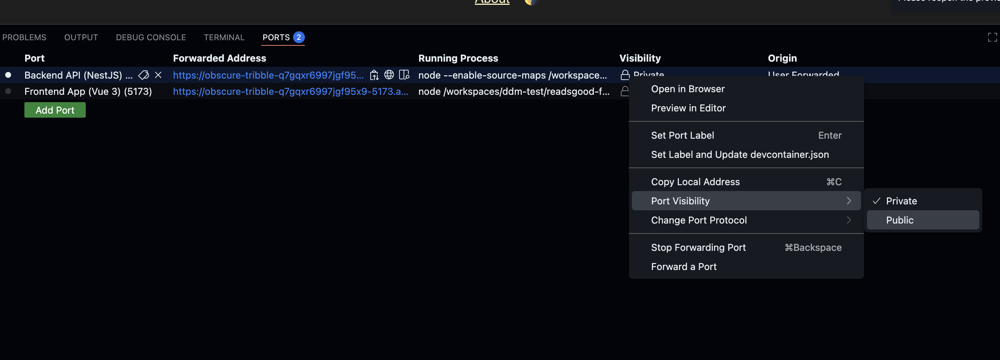

## DDM-TEST

## Run in Codespaces

1. Open this repository in [Codespaces](https://github.com/codespaces/new?repo=1027430466).

   It uses a custom devcontainer, so it might take several minutes to build.

2. Wait until the terminal opens and displays this:

    

3. Run `./run-in-codespaces.sh`.

    You will be prompted to enter your Goodreads secrets.

4. Make sure to set the visibility of port 3000 to public.

    At some point, you will be prompted to make the port public. Click "Make Public".

    

    Alternatively, you can open the Ports tab and set the port visibility to "Public."

    

5. After the process is complete, open the app URL in a new browser tab.

## Try it out live

The app is deployed [on my VPS](https://rg.lushchik.com/).
